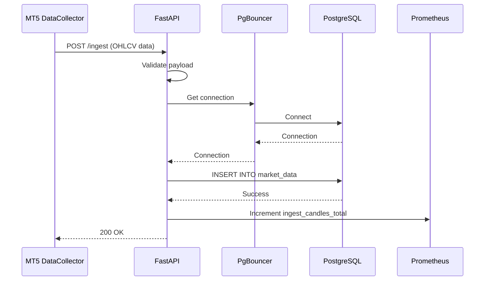
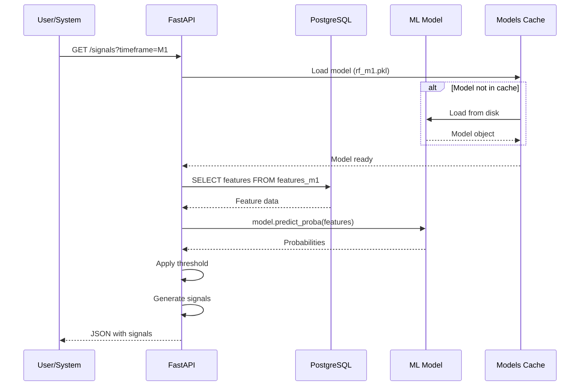
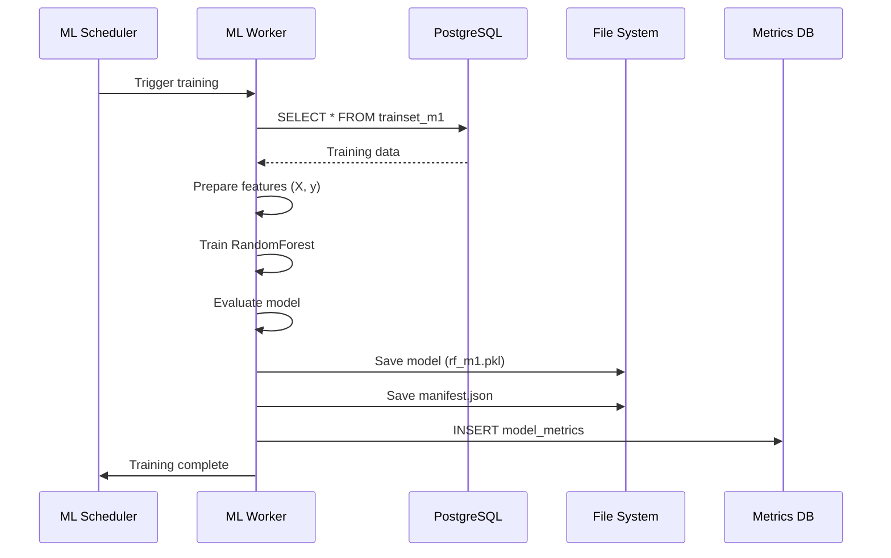
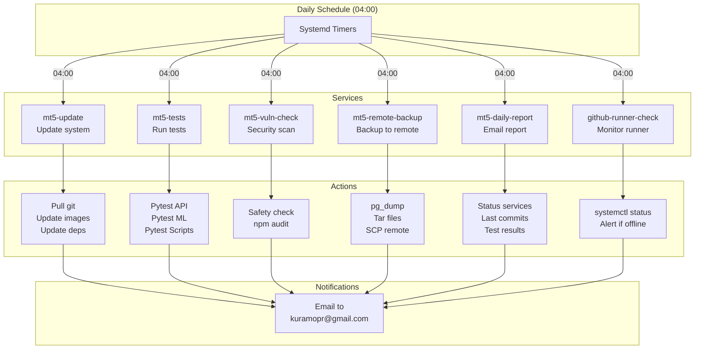
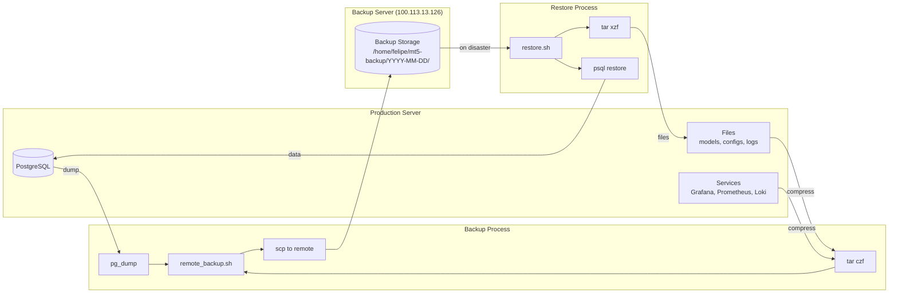
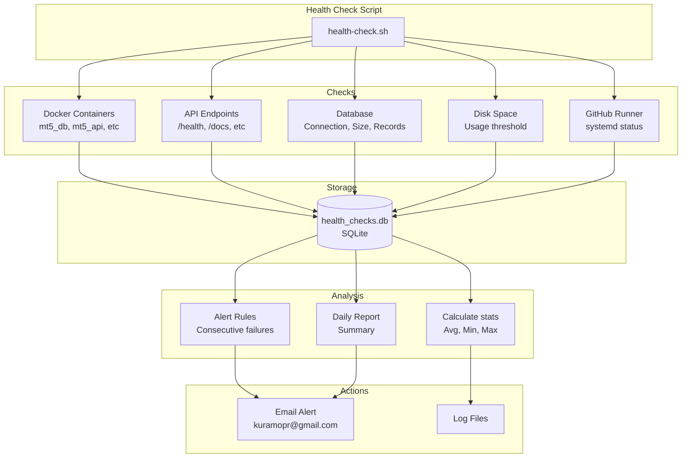
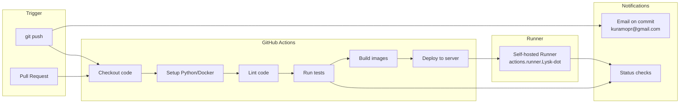
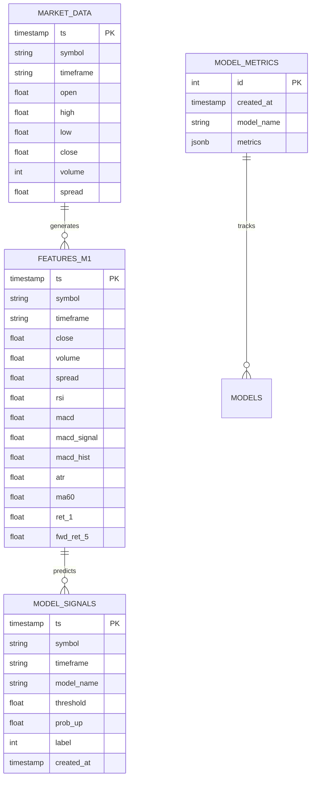

# MT5 Trading System - Diagramas de Arquitetura

## Arquitetura Geral do Sistema

```mermaid
graph TB
    subgraph "External"
        MT5[MT5 Terminal/DataCollector]
        User[User/Trader]
        RemoteBackup[Backup Server<br/>100.113.13.126]
    end

    subgraph "API Layer"
        API[FastAPI<br/>Port 8001]
        APIMetrics[/prometheus<br/>metrics]
    end

    subgraph "Data Layer"
        PgBouncer[PgBouncer<br/>Connection Pool<br/>Port 6432]
        DB[(PostgreSQL<br/>TimescaleDB<br/>Port 5432)]
    end

    subgraph "ML Layer"
        MLWorker[ML Worker<br/>Training]
        MLScheduler[ML Scheduler]
        MLModels[Models Storage<br/>ml/models/]
    end

    subgraph "Observability Stack"
        Prometheus[Prometheus<br/>Port 9090]
        Grafana[Grafana<br/>Port 3000]
        Loki[Loki<br/>Port 3100]
        Promtail[Promtail<br/>Log Collector]
        Jaeger[Jaeger<br/>Port 16686]
    end

    subgraph "Automation"
        Systemd[Systemd Timers]
        GHRunner[GitHub Actions<br/>Runner]
        Scripts[Maintenance Scripts]
    end

    MT5 -->|POST /ingest| API
    User -->|HTTP Requests| API
    API -->|Queries| PgBouncer
    PgBouncer -->|Connection Pool| DB

    MLScheduler -->|Triggers| MLWorker
    MLWorker -->|Reads Features| DB
    MLWorker -->|Saves Models| MLModels
    API -->|Loads Models| MLModels
    API -->|Generates Signals| DB

    API -->|Metrics| Prometheus
    DB -->|Metrics| Prometheus
    Prometheus -->|Data Source| Grafana

    API -->|Logs| Promtail
    MLWorker -->|Logs| Promtail
    Promtail -->|Push| Loki
    Loki -->|Data Source| Grafana

    API -->|Traces| Jaeger
    Jaeger -->|Data Source| Grafana

    Systemd -->|Runs| Scripts
    Scripts -->|Maintenance| API
    Scripts -->|Maintenance| DB
    Scripts -->|Backup| RemoteBackup
    GHRunner -->|CI/CD| API

    style API fill:#4CAF50
    style DB fill:#2196F3
    style Prometheus fill:#E96228
    style Grafana fill:#F46800
    style MLWorker fill:#9C27B0
```

## Fluxo de Dados - Ingestão



## Fluxo de Dados - Geração de Sinais



## Fluxo de Dados - Treinamento ML



## Fluxo de Monitoramento

```mermaid
graph LR
    subgraph "Sources"
        API[API Metrics]
        DB[DB Metrics]
        Node[Node Exporter]
        Logs[Application Logs]
        Traces[Traces]
    end

    subgraph "Collection"
        Prom[Prometheus<br/>Scrape]
        Promtail[Promtail<br/>Push]
        Jaeger[Jaeger<br/>Collect]
    end

    subgraph "Storage"
        PromDB[(Prometheus DB)]
        LokiDB[(Loki DB)]
        JaegerDB[(Jaeger DB)]
    end

    subgraph "Visualization"
        Grafana[Grafana<br/>Dashboards]
    end

    subgraph "Alerting"
        Alerts[Alert Rules]
        Email[Email<br/>kuramopr@gmail.com]
    end

    API -->|metrics| Prom
    DB -->|metrics| Prom
    Node -->|metrics| Prom
    Prom -->|store| PromDB

    Logs -->|logs| Promtail
    Promtail -->|push| LokiDB

    Traces -->|traces| Jaeger
    Jaeger -->|store| JaegerDB

    PromDB -->|query| Grafana
    LokiDB -->|query| Grafana
    JaegerDB -->|query| Grafana

    Grafana -->|evaluate| Alerts
    Alerts -->|notify| Email
```

## Automação e Manutenção



## Backup e Disaster Recovery



## Health Check System



## CI/CD Pipeline (GitHub Actions)



## Database Schema (Simplified)


