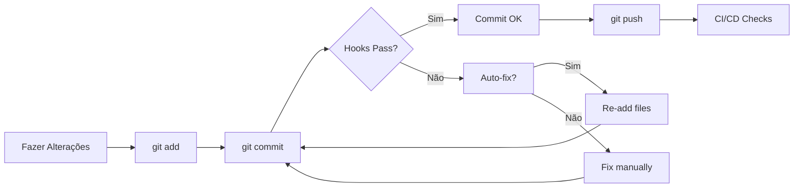

<!-- =============================================================
Copyright (c) 2025 Felipe Petracco Carmo <kuramopr@gmail.com>
All rights reserved. | Todos os direitos reservados.
Private License: This code is the exclusive property of Felipe Petracco Carmo.
Redistribution, copying, modification or commercial use is NOT permitted without express authorization.
Licença privada: Este código é propriedade exclusiva de Felipe Petracco Carmo.
Não é permitida redistribuição, cópia, modificação ou uso comercial sem autorização expressa.
============================================================= -->

# 🔧 Pre-commit Hooks Guide

Guia completo sobre o sistema de pre-commit hooks configurado no projeto MT5 Trading DB.

---

## 📋 Índice

- [O que é Pre-commit?](#o-que-é-pre-commit)
- [Instalação](#instalação)
- [Hooks Configurados](#hooks-configurados)
- [Como Usar](#como-usar)
- [Comandos Úteis](#comandos-úteis)
- [Troubleshooting](#troubleshooting)
- [Configuração Avançada](#configuração-avançada)

---

## 🤔 O que é Pre-commit?

Pre-commit é um framework que gerencia e mantém hooks Git multi-linguagem. Ele executa automaticamente verificações de qualidade de código antes de cada commit, garantindo que apenas código de alta qualidade seja adicionado ao repositório.

### Benefícios

✅ **Qualidade Consistente** - Todos os commits seguem os mesmos padrões
✅ **Detecção Precoce** - Problemas encontrados antes do commit
✅ **Automação** - Correções automáticas quando possível
✅ **Segurança** - Detecção de secrets e vulnerabilidades
✅ **Produtividade** - Menos tempo em code reviews

---

## 🚀 Instalação

### 1. Ativar o ambiente virtual

```bash
cd /home/felipe/MT5-Process-Core-full
source .venv/bin/activate
```

### 2. Instalar pre-commit (se ainda não estiver instalado)

```bash
pip install pre-commit
```

### 3. Instalar os hooks no repositório Git

```bash
pre-commit install
pre-commit install --hook-type commit-msg
pre-commit install --hook-type pre-push
```

### 4. Verificar instalação

```bash
pre-commit --version
# Output: pre-commit 4.3.0
```

---

## 🔍 Hooks Configurados

### 1. **Python - Formatação e Linting**

#### Ruff

- **O que faz:** Linter Python ultra-rápido (substitui flake8, pylint, etc)
- **Quando roda:** A cada commit
- **Correção automática:** Sim
- **Comando manual:**

  ```bash
  ruff check --fix api ml scripts
  ruff format api ml scripts
  ```

#### Black

- **O que faz:** Formatador de código Python
- **Quando roda:** A cada commit
- **Correção automática:** Sim
- **Configuração:** Linha máxima de 100 caracteres
- **Comando manual:**

  ```bash
  black --line-length=100 api ml scripts
  ```

#### isort

- **O que faz:** Organiza imports Python
- **Quando roda:** A cada commit
- **Correção automática:** Sim
- **Configuração:** Perfil Black
- **Comando manual:**

  ```bash
  isort --profile black --line-length 100 api ml scripts
  ```

#### mypy

- **O que faz:** Verificação de tipos estáticos
- **Quando roda:** A cada commit (apenas arquivos Python)
- **Correção automática:** Não
- **Comando manual:**

  ```bash
  mypy --config-file=mypy.ini api ml scripts
  ```

---

### 2. **Segurança**

#### Bandit

- **O que faz:** Encontra problemas de segurança comuns em Python
- **Quando roda:** A cada commit
- **Severidade:** Medium
- **Comando manual:**

  ```bash
  bandit -c .bandit.yaml -r api ml scripts
  ```

#### Detect Secrets

- **O que faz:** Detecta credenciais e secrets commitados acidentalmente
- **Quando roda:** A cada commit
- **Baseline:** `.secrets.baseline`
- **Comando manual:**

  ```bash
  detect-secrets scan --baseline .secrets.baseline
  ```

#### Safety

- **O que faz:** Verifica vulnerabilidades conhecidas nas dependências Python
- **Quando roda:** Ao modificar requirements.txt
- **Comando manual:**

  ```bash
  safety check -r requirements.txt
  ```

---

### 3. **Docker e Shell**

#### Hadolint

- **O que faz:** Linter para Dockerfiles
- **Quando roda:** Ao modificar Dockerfiles
- **Ignora:** DL3008, DL3009, DL3015
- **Comando manual:**

  ```bash
  hadolint api/Dockerfile
  hadolint ml/Dockerfile
  ```

#### ShellCheck

- **O que faz:** Linter para scripts shell
- **Quando roda:** Ao modificar arquivos .sh
- **Severidade:** Warning e acima
- **Comando manual:**

  ```bash
  shellcheck scripts/*.sh
  ```

---

### 4. **Documentação**

#### Markdownlint

- **O que faz:** Linter e formatador para arquivos Markdown
- **Quando roda:** Ao modificar arquivos .md
- **Correção automática:** Sim
- **Comando manual:**

  ```bash
  markdownlint --fix --config .markdownlint.yaml docs/*.md README.md
  ```

#### Interrogate

- **O que faz:** Verifica cobertura de docstrings em Python
- **Quando roda:** A cada commit
- **Threshold:** 40%
- **Comando manual:**

  ```bash
  interrogate -vv --fail-under=40 api ml
  ```

---

### 5. **SQL**

#### SQLFluff

- **O que faz:** Linter e formatador para SQL
- **Quando roda:** Ao modificar arquivos .sql
- **Dialeto:** PostgreSQL
- **Correção automática:** Sim
- **Comando manual:**

  ```bash
  sqlfluff lint --dialect postgres sql/*.sql
  sqlfluff fix --dialect postgres sql/*.sql
  ```

---

### 6. **Verificações Gerais**

#### Pre-commit Hooks

- ✅ Trim trailing whitespace
- ✅ Fix end of files
- ✅ Check YAML syntax
- ✅ Check JSON syntax
- ✅ Check TOML syntax
- ✅ Check for large files (>1MB)
- ✅ Check for merge conflicts
- ✅ Check for case conflicts
- ✅ Check docstring first
- ✅ Detect debug statements
- ✅ Fix mixed line endings (LF)
- ✅ Detect private keys

---

### 7. **Custom Hooks**

#### Copyright Header

- **O que faz:** Adiciona/verifica header de copyright em arquivos
- **Script:** `scripts/add_header.py`
- **Arquivos:** .py, .sh, Dockerfile, .yml, .yaml, .md, .sql, etc
- **Quando roda:** A cada commit

---

## 💻 Como Usar

### Workflow Normal

1. **Faça suas alterações**

   ```bash
   vim api/app/main.py
   ```

2. **Stage os arquivos**

   ```bash
   git add api/app/main.py
   ```

3. **Commit (hooks rodam automaticamente)**

   ```bash
   git commit -m "feat: adiciona novo endpoint"
   ```

4. **Se houver problemas:**
   - Hooks com auto-fix corrigirão automaticamente
   - Arquivos corrigidos serão mostrados
   - Você precisará adicionar as correções novamente

5. **Re-stage e commit novamente**

   ```bash
   git add api/app/main.py
   git commit -m "feat: adiciona novo endpoint"
   ```

---

## 🛠️ Comandos Úteis

### Rodar todos os hooks manualmente

```bash
# Em todos os arquivos
pre-commit run --all-files

# Apenas em arquivos staged
pre-commit run

# Em arquivos específicos
pre-commit run --files api/app/main.py
```

### Rodar um hook específico

```bash
# Apenas Black
pre-commit run black --all-files

# Apenas Ruff
pre-commit run ruff --all-files

# Apenas mypy
pre-commit run mypy --all-files

# Apenas Bandit
pre-commit run bandit --all-files
```

### Atualizar hooks

```bash
# Atualizar para as versões mais recentes
pre-commit autoupdate

# Limpar cache de hooks
pre-commit clean
```

### Pular hooks (não recomendado)

```bash
# Pular todos os hooks (EVITE USAR!)
git commit --no-verify -m "mensagem"

# Ou variável de ambiente
SKIP=black,ruff git commit -m "mensagem"
```

### Instalar/Desinstalar

```bash
# Instalar hooks
pre-commit install

# Desinstalar hooks
pre-commit uninstall

# Reinstalar hooks
pre-commit uninstall && pre-commit install
```

---

## 🐛 Troubleshooting

### Problema: Hook está falhando mas localmente funciona

**Solução:**

```bash
# Limpar cache e reinstalar
pre-commit clean
pre-commit install --install-hooks
pre-commit run --all-files
```

### Problema: mypy não encontra imports

**Solução:**

```bash
# Adicionar dependências no .pre-commit-config.yaml
# Seção mypy -> additional_dependencies
```

### Problema: Hook muito lento

**Solução:**

```bash
# Desabilitar hooks pesados temporariamente
SKIP=mypy,bandit git commit -m "mensagem"

# Ou modificar .pre-commit-config.yaml para rodar em menos arquivos
```

### Problema: Conflito entre Black e Ruff

**Solução:**

```bash
# Já configurado! Ambos usam line-length=100 e profile=black
# Se persistir, rode na ordem:
pre-commit run ruff --all-files
pre-commit run black --all-files
```

### Problema: Secrets detectados por engano

**Solução:**

```bash
# Atualizar baseline
detect-secrets scan > .secrets.baseline

# Ou adicionar exceções manualmente no .secrets.baseline
```

---

## ⚙️ Configuração Avançada

### Adicionar novo hook

1. Edite `.pre-commit-config.yaml`
2. Adicione o repositório e hook desejado
3. Atualize os hooks:

   ```bash
   pre-commit install --install-hooks
   ```

### Exemplo: Adicionar pytest

```yaml
- repo: local
  hooks:
    - id: pytest
      name: Run pytest
      entry: pytest
      language: system
      pass_filenames: false
      always_run: true
```

### Configurar CI/CD

Adicione ao `.github/workflows/ci.yml`:

```yaml
- name: Run pre-commit
  uses: pre-commit/action@v3.0.0
```

### Configurar linha de comando personalizada

Crie `~/.pre-commit-config.yaml` para configurações globais.

---

## 📊 Estatísticas

### Hooks Configurados: 30+

| Categoria | Quantidade |
|-----------|-----------|
| Python Quality | 5 |
| Security | 3 |
| Docker/Shell | 2 |
| Documentation | 2 |
| SQL | 2 |
| File Checks | 14+ |
| Custom | 1 |

### Tempo Médio de Execução

| Hook | Tempo (aprox) |
|------|---------------|
| Ruff | < 1s |
| Black | < 1s |
| isort | < 1s |
| mypy | 3-5s |
| Bandit | 2-3s |
| All hooks | 10-15s |

---

## 📚 Recursos

- [Pre-commit Documentation](https://pre-commit.com/)
- [Ruff Documentation](https://docs.astral.sh/ruff/)
- [Black Documentation](https://black.readthedocs.io/)
- [mypy Documentation](https://mypy.readthedocs.io/)
- [Bandit Documentation](https://bandit.readthedocs.io/)

---

## 🎯 Boas Práticas

### DO ✅

- ✅ Rode `pre-commit run --all-files` após atualizar configurações
- ✅ Mantenha os hooks atualizados com `pre-commit autoupdate`
- ✅ Corrija problemas apontados pelos hooks
- ✅ Adicione exceções quando necessário (com justificativa)
- ✅ Rode hooks manualmente antes de fazer PR

### DON'T ❌

- ❌ Não use `--no-verify` regularmente
- ❌ Não ignore erros de segurança do Bandit
- ❌ Não commite secrets (mesmo que detectados)
- ❌ Não desabilite hooks sem consultar o time
- ❌ Não commite arquivos muito grandes

---

## 🔄 Workflow Recomendado



---

**Última atualização:** 2025-10-20
**Mantido por:** Felipe
**Versão:** 1.0.0
