# 🚀 Kubernetes Auto-Scaling e Sistema de Snapshots

## 📋 Índice

- [Auto-Scaling no Kubernetes](#auto-scaling-no-kubernetes)
- [Sistema de Snapshots](#sistema-de-snapshots)
- [Integração CI/CD](#integração-cicd)
- [Guias de Uso](#guias-de-uso)

---

## 🎯 Auto-Scaling no Kubernetes

### Componentes Implementados

#### 1. **Horizontal Pod Autoscaler (HPA)**

Escala automaticamente o número de pods baseado em métricas.

**Arquivo**: `k8s/base/hpa.yaml`

##### HPA da API (2-10 replicas)

```yaml
apiVersion: autoscaling/v2
kind: HorizontalPodAutoscaler
metadata:
  name: api-hpa
spec:
  minReplicas: 2
  maxReplicas: 10
  metrics:
  - type: Resource
    resource:
      name: cpu
      target:
        averageUtilization: 70
  - type: Resource
    resource:
      name: memory
      target:
        averageUtilization: 80
  - type: Pods
    pods:
      metric:
        name: http_requests_per_second
      target:
        averageValue: "1000"
```

**Comportamento**:

- **Scale Up**: Imediato quando CPU > 70% ou MEM > 80%
- **Scale Down**: Espera 5 minutos para estabilizar
- **Política**: Dobra pods ao escalar (máx 4 pods por vez)

##### HPA do ML Worker (1-5 replicas)

```yaml
apiVersion: autoscaling/v2
kind: HorizontalPodAutoscaler
metadata:
  name: ml-worker-hpa
spec:
  minReplicas: 1
  maxReplicas: 5
  metrics:
  - type: Resource
    resource:
      name: cpu
      target:
        averageUtilization: 80
```

**Comportamento**:

- **Scale Up**: Aguarda 1 minuto
- **Scale Down**: Espera 10 minutos (tarefas ML são longas)

---

#### 2. **Vertical Pod Autoscaler (VPA)**

Ajusta automaticamente requests/limits de CPU e memória.

**Arquivo**: `k8s/base/vpa.yaml`

##### VPA do PostgreSQL (Auto)

```yaml
apiVersion: autoscaling.k8s.io/v1
kind: VerticalPodAutoscaler
metadata:
  name: postgres-vpa
spec:
  updatePolicy:
    updateMode: "Auto"
  resourcePolicy:
    containerPolicies:
    - containerName: postgres
      minAllowed:
        cpu: 500m
        memory: 1Gi
      maxAllowed:
        cpu: 4
        memory: 8Gi
```

**Comportamento**: Aplica recomendações automaticamente

##### VPA da API (Recomendação apenas)

```yaml
apiVersion: autoscaling.k8s.io/v1
kind: VerticalPodAutoscaler
metadata:
  name: api-vpa
spec:
  updatePolicy:
    updateMode: "Off"  # HPA controla
```

**Comportamento**: Apenas recomenda, não aplica (HPA tem prioridade)

---

#### 3. **Pod Disruption Budget (PDB)**

Garante disponibilidade durante manutenções.

**Arquivo**: `k8s/base/pdb.yaml`

```yaml
# API - sempre 1 pod disponível
apiVersion: policy/v1
kind: PodDisruptionBudget
metadata:
  name: api-pdb
spec:
  minAvailable: 1
  selector:
    matchLabels:
      app: mt5-api

# PostgreSQL - nunca indisponível
apiVersion: policy/v1
kind: PodDisruptionBudget
metadata:
  name: postgres-pdb
spec:
  maxUnavailable: 0
```

---

#### 4. **Metrics Server**

Fornece métricas para o HPA funcionar.

**Arquivo**: `k8s/base/metrics-server.yaml`

```bash
# Instalar
kubectl apply -f k8s/base/metrics-server.yaml

# Verificar
kubectl top nodes
kubectl top pods -n mt5-trading
```

---

### 🚀 Deploy do Auto-Scaling

```bash
# 1. Instalar Metrics Server
kubectl apply -f k8s/base/metrics-server.yaml

# 2. Aplicar HPAs
kubectl apply -f k8s/base/hpa.yaml

# 3. Aplicar VPAs (opcional)
kubectl apply -f k8s/base/vpa.yaml

# 4. Aplicar PDBs
kubectl apply -f k8s/base/pdb.yaml

# 5. Verificar status
kubectl get hpa -n mt5-trading
kubectl get vpa -n mt5-trading
kubectl get pdb -n mt5-trading
```

---

### 📊 Monitoramento do Auto-Scaling

#### Ver status do HPA

```bash
# Status completo
kubectl describe hpa api-hpa -n mt5-trading

# Resumo
kubectl get hpa -n mt5-trading --watch

# Métricas atuais
kubectl top pods -n mt5-trading
```

#### Ver eventos de scaling

```bash
# Últimos eventos
kubectl get events -n mt5-trading --sort-by='.lastTimestamp' | grep -i scale

# Watch em tempo real
kubectl get events -n mt5-trading --watch
```

#### Ver recomendações do VPA

```bash
# Ver recomendações
kubectl describe vpa postgres-vpa -n mt5-trading

# Ver status
kubectl get vpa -n mt5-trading
```

---

### 🧪 Testar Auto-Scaling

#### Teste de carga na API

```bash
# Instalar hey (ferramenta de load test)
go install github.com/rakyll/hey@latest

# Gerar carga
hey -z 5m -c 50 -q 10 http://api-service.mt5-trading.svc.cluster.local:8001/health

# Monitorar scaling
watch -n 2 kubectl get hpa,pods -n mt5-trading
```

#### Simular uso alto de CPU

```bash
# Exec no pod
kubectl exec -it -n mt5-trading deployment/api -- sh

# Gerar carga de CPU
while true; do :; done
```

---

## 📸 Sistema de Snapshots

### Visão Geral

Sistema completo de snapshots automáticos que captura:

- ✅ Repositório Git (bundle completo)
- ✅ Backup do banco de dados
- ✅ Volumes Docker
- ✅ Arquivos de configuração
- ✅ Logs (opcional)

### Arquivos

```
scripts/backup/
├── create-snapshot.sh    # Cria snapshot completo
└── restore-snapshot.sh   # Restaura snapshot

.github/workflows/
└── snapshots.yml         # Automação via GitHub Actions
```

---

### 🔧 Criar Snapshot Manual

#### Básico

```bash
# Snapshot simples
./scripts/backup/create-snapshot.sh

# Snapshot completo (com logs)
./scripts/backup/create-snapshot.sh --full

# Upload para storage remoto
./scripts/backup/create-snapshot.sh --remote

# Snapshot com nome customizado
./scripts/backup/create-snapshot.sh --name backup-pre-migration
```

#### Opções

| Flag | Descrição |
|------|-----------|
| `-f, --full` | Incluir logs e arquivos temporários |
| `-r, --remote` | Upload para storage remoto (rclone) |
| `-n, --name` | Nome customizado para snapshot |
| `-h, --help` | Exibir ajuda |

---

### 🔄 Restaurar Snapshot

```bash
# Listar snapshots disponíveis
ls -lh /home/felipe/backups/snapshots/mt5-snapshot-*.tar.gz

# Restaurar snapshot específico
./scripts/backup/restore-snapshot.sh mt5-snapshot-20251018_120000

# Restaurar com opções
./scripts/backup/restore-snapshot.sh mt5-snapshot-20251018_120000 --skip-db
./scripts/backup/restore-snapshot.sh mt5-snapshot-20251018_120000 --skip-volumes
./scripts/backup/restore-snapshot.sh mt5-snapshot-20251018_120000 --force
```

#### Opções de Restore

| Flag | Descrição |
|------|-----------|
| `--skip-db` | Não restaurar banco de dados |
| `--skip-volumes` | Não restaurar volumes Docker |
| `--skip-git` | Não restaurar repositório Git |
| `-f, --force` | Restaurar sem confirmação |

---

### 🤖 Snapshots Automáticos

#### Trigger: CI/CD Aprovado

Os snapshots são criados **automaticamente** após o CI/CD passar:

```yaml
# .github/workflows/snapshots.yml
on:
  workflow_run:
    workflows: ["CI/CD Pipeline", "Deploy to Production"]
    types:
      - completed
    branches:
      - main
```

**Fluxo**:

1. ✅ Push no branch `main`
2. ✅ CI/CD roda e passa todos os testes
3. ✅ Deploy é feito com sucesso
4. ✅ **Snapshot é criado automaticamente**
5. ✅ Snapshot é verificado (checksums)
6. ✅ Teste de restore é executado (agendado)

#### Trigger: Agendado

Snapshots diários às **2:00 AM UTC-3** (5:00 AM UTC):

```yaml
on:
  schedule:
    - cron: '0 5 * * *'
```

#### Trigger: Manual

```bash
# Via GitHub Actions UI
# 1. Ir em Actions → Automated Repository Snapshots
# 2. Clicar em "Run workflow"
# 3. Selecionar opções (include logs, upload remote)
# 4. Rodar
```

---

### 📦 Estrutura de um Snapshot

```
mt5-snapshot-20251018_120000/
├── repository.bundle              # Git bundle completo
├── git-info.txt                   # Metadata do git
├── database-full.sql.gz           # Dump completo do PostgreSQL
├── database-mt5_trading.sql.gz    # Dump do banco mt5_trading
├── database-info.txt              # Info do banco (tamanho, tabelas)
├── volumes/                       # Backups dos volumes
│   ├── mt5-trading-db_db_data.tar.gz
│   ├── mt5-trading-db_prometheus_data.tar.gz
│   ├── mt5-trading-db_grafana_data.tar.gz
│   ├── mt5-trading-db_loki_data.tar.gz
│   ├── mt5-trading-db_jaeger_data.tar.gz
│   └── models_mt5.tar.gz
├── config/                        # Configurações
│   ├── docker-compose.yml
│   ├── .env
│   ├── prometheus.yml
│   ├── loki/
│   ├── grafana-provisioning/
│   └── k8s/
├── logs/ (opcional)               # Logs recentes
│   ├── docker/
│   └── *.log
├── SNAPSHOT_INFO.txt              # Metadata completo
└── checksums.sha256               # Checksums SHA256
```

---

### 🔐 Configurar Storage Remoto (rclone)

#### 1. Instalar rclone

```bash
curl https://rclone.org/install.sh | sudo bash
```

#### 2. Configurar remote (S3/B2/Drive)

```bash
rclone config

# Exemplo para Backblaze B2:
# n) New remote
# name> b2
# Storage> b2
# Account ID> <seu-account-id>
# Application Key> <sua-key>
```

#### 3. Testar upload

```bash
rclone copy /home/felipe/backups/snapshots/ b2:mt5-backups/snapshots/ --progress
```

#### 4. Configurar no snapshot

```bash
# Editar create-snapshot.sh e alterar:
rclone copy "${SNAPSHOT_NAME}.tar.gz" b2:mt5-backups/snapshots/ --progress
```

---

### 📊 Monitoramento de Snapshots

#### Ver snapshots criados

```bash
# Listar todos
ls -lh /home/felipe/backups/snapshots/

# Ver últimos 10
ls -lt /home/felipe/backups/snapshots/mt5-snapshot-*.tar.gz | head -10

# Ver índice de snapshots
cat /home/felipe/backups/snapshots/snapshots-index.txt
```

#### Ver info de um snapshot

```bash
# Extrair e ver info
SNAPSHOT="mt5-snapshot-20251018_120000"
tar xzf "/home/felipe/backups/snapshots/${SNAPSHOT}.tar.gz" -C /tmp
cat "/tmp/${SNAPSHOT}/SNAPSHOT_INFO.txt"
```

#### Ver logs do GitHub Actions

```bash
# Via CLI do GitHub
gh run list --workflow=snapshots.yml

# Ver detalhes do último run
gh run view --workflow=snapshots.yml
```

---

### 🧹 Limpeza Automática

O script mantém automaticamente:

- **10 snapshots comprimidos** mais recentes
- **5 snapshots descomprimidos** mais recentes

Para alterar:

```bash
# Editar create-snapshot.sh
# Linha ~280:
ls -t "${BACKUP_BASE_DIR}"/mt5-snapshot-*.tar.gz | tail -n +11 | xargs rm -f
# Alterar +11 para +X (onde X = número de snapshots + 1)
```

---

## 🔗 Integração CI/CD

### Fluxo Completo

```mermaid
graph LR
    A[Push to main] --> B[CI/CD Pipeline]
    B --> C{Tests Pass?}
    C -->|No| D[❌ Fail - No Snapshot]
    C -->|Yes| E[✅ Deploy]
    E --> F[✅ Create Snapshot]
    F --> G[✅ Verify Integrity]
    G --> H[📦 Store Snapshot]
```



### Workflows

1. **deploy.yml** - Deploy automático
2. **auto-commit.yml** - Commits automáticos (4AM)
3. **health-check.yml** - Health checks (5min)
4. **snapshots.yml** - Snapshots após CI/CD ✨

---

## 📝 Guias de Uso

### Cenário 1: Backup Antes de Update Crítico

```bash
# 1. Criar snapshot manual com nome descritivo
./scripts/backup/create-snapshot.sh --name backup-before-v2-migration --full

# 2. Fazer suas mudanças
git pull
docker-compose up -d

# 3. Se algo der errado, restaurar
./scripts/backup/restore-snapshot.sh backup-before-v2-migration
```

### Cenário 2: Disaster Recovery

```bash
# 1. Listar snapshots disponíveis
ls -lh /home/felipe/backups/snapshots/

# 2. Restaurar snapshot mais recente
LATEST=$(ls -t /home/felipe/backups/snapshots/mt5-snapshot-*.tar.gz | head -1 | xargs basename .tar.gz)
./scripts/backup/restore-snapshot.sh $LATEST --force

# 3. Verificar serviços
docker-compose ps
curl http://localhost:8001/health
```

### Cenário 3: Migração para Novo Servidor

```bash
# Servidor Antigo:
# 1. Criar snapshot completo
./scripts/backup/create-snapshot.sh --full --remote

# 2. Upload para storage remoto (se não fez --remote)
rclone copy /home/felipe/backups/snapshots/mt5-snapshot-*.tar.gz remote:backups/

# Servidor Novo:
# 3. Download snapshot
rclone copy remote:backups/mt5-snapshot-20251018_120000.tar.gz /home/felipe/backups/snapshots/

# 4. Extrair e restaurar
cd /home/felipe/backups/snapshots
tar xzf mt5-snapshot-20251018_120000.tar.gz
./restore-snapshot.sh mt5-snapshot-20251018_120000
```

### Cenário 4: Testar Snapshot Periodicamente

```bash
# Script de teste semanal (já no cron do GitHub Actions)
# Mas você pode testar manualmente:

# 1. Criar snapshot de teste
./scripts/backup/create-snapshot.sh --name test-restore

# 2. Restaurar em diretório temporário
# (modificar script para usar temp dir)

# 3. Verificar integridade
git bundle verify test-restore/repository.bundle
```

---

## 🎯 Best Practices

### Auto-Scaling

✅ **DO**:

- Monitorar métricas do HPA regularmente
- Ajustar `minReplicas` baseado no tráfego real
- Usar PDB para garantir disponibilidade
- Testar scaling sob carga antes de produção

❌ **DON'T**:

- Não usar HPA e VPA juntos no mesmo deployment
- Não definir `maxReplicas` muito alto sem teste
- Não ignorar alertas de CPU/MEM altos
- Não esquecer de configurar resource requests/limits

### Snapshots

✅ **DO**:

- Criar snapshot antes de mudanças críticas
- Testar restore periodicamente
- Manter snapshots em storage remoto
- Documentar mudanças importantes

❌ **DON'T**:

- Não confiar apenas em snapshots locais
- Não deixar snapshots sem verificação
- Não restaurar sem backup atual
- Não ignorar erros de checksum

---

## 🐛 Troubleshooting

### HPA não escala

```bash
# Verificar metrics server
kubectl get apiservice v1beta1.metrics.k8s.io
kubectl top nodes

# Ver métricas do HPA
kubectl get hpa api-hpa -n mt5-trading -o yaml

# Ver eventos
kubectl describe hpa api-hpa -n mt5-trading
```

### Snapshot falhou

```bash
# Ver logs do GitHub Actions
gh run view --workflow=snapshots.yml --log

# Verificar permissões
ls -la /home/felipe/backups/snapshots/
docker ps | grep mt5_db

# Testar manualmente
./scripts/backup/create-snapshot.sh --name test-manual
```

### Restore falhou

```bash
# Verificar checksums
cd /home/felipe/backups/snapshots/mt5-snapshot-*/
sha256sum -c checksums.sha256

# Ver logs detalhados
./scripts/backup/restore-snapshot.sh SNAPSHOT_NAME 2>&1 | tee restore.log

# Restaurar componente por componente
./scripts/backup/restore-snapshot.sh SNAPSHOT_NAME --skip-volumes
./scripts/backup/restore-snapshot.sh SNAPSHOT_NAME --skip-db --skip-git
```

---

## 📚 Referências

- [Kubernetes HPA](https://kubernetes.io/docs/tasks/run-application/horizontal-pod-autoscale/)
- [Kubernetes VPA](https://github.com/kubernetes/autoscaler/tree/master/vertical-pod-autoscaler)
- [rclone Documentation](https://rclone.org/docs/)
- [Git Bundle](https://git-scm.com/docs/git-bundle)

---

**Última atualização**: 2025-10-18
**Versão**: 1.0.0
